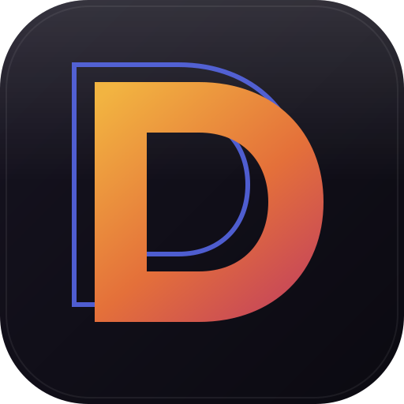

<p align="center">
  
</p>

<h1 align="center">Dolos</h1>

<p align="center">
  <em>Análise de satisfação em atendimentos por chatbot — sem LLM em runtime.</em>
</p>

---

## O problema

O cliente mente.

Ele digita "ok, obrigado 🙂" e vai embora insatisfeito. Modelos que olham só
características genéricas da conversa — número de mensagens, intents previstos —
explicam cerca de **10% da variância** da satisfação declarada[^1], e há
inconsistência sistemática entre a nota que o cliente dá e o texto que ele
escreve[^2].

Dolos, o daemon grego do ardil e do engano, lê o que foi dito de verdade.

## Como funciona

Três sinais independentes, calculados sobre um modelo canônico de conversa e
fundidos por um classificador leve:

| Sinal | O que mede | Por quê |
|---|---|---|
| **Texto** | BERTimbau fine-tunado, probabilidade **por mensagem** | permite apontar *quais trechos* puxaram a nota |
| **Emoji** | polaridade e **posição relativa** na mensagem | a polaridade do emoji cresce perto do fim da frase |
| **Tempo** | latência, escalação, abandono | o efeito é não-linear — o peso é aprendido, não arbitrado |

O resultado é um score de 0 a 100 por atendimento, que vira nota 0–10 e categoria
de NPS (**0–6 detrator · 7–8 neutro · 9–10 promotor**), agregado numa dashboard.

## Indicadores

NPS inferido · CSAT · containment rate · tempo mediano de resposta — com NPS e
latência **sobrepostos no mesmo gráfico**, porque otimizar um KPI isolado quebra
outro.

> **Nota metodológica:** o NPS aqui é **inferido do texto**, não perguntado ao
> cliente. A dashboard rotula como estimativa.

## Stack

Python 3.11 · transformers + torch (CPU) · scikit-learn · FastAPI · SQLite ·
Next.js + Recharts

Sem base vetorial: a tarefa é classificação, e para classificação o fine-tuning
vence RAG em acurácia e latência[^3].

## Documentação

- [Spec de design](docs/superpowers/specs/2026-08-13-dolos-design.md) — decisões e referências
- [Plano de implementação](docs/superpowers/plans/2026-08-13-dolos-implementacao.md) — 10 tasks
- [Treinamento](docs/treinamento.md) — notebook Colab e artefato do modelo

## Desenvolvimento

```bash
uv sync
uv run pytest -v
uv run uvicorn dolos.api.main:app --reload   # exige modelos/ treinado; falha alto sem ele
```

```bash
cd dashboard && npm install && npm run dev
```

### Servidor de demonstração da interface

O `app` real carrega o BERTimbau do disco e **falha alto** se `modelos/` não
existir — por design. Enquanto o treino do Colab não roda, a dashboard é
desenvolvida contra um servidor de demonstração que usa um motor dublê
(pontuação determinística derivada do texto, sem modelo nenhum) e semeia um
banco temporário com conversas do simulador, incluindo atendimentos **sem fala
do cliente** para exercitar o estado "sem sinal":

```bash
uv run python scripts/api_demo.py   # http://localhost:8000
```

**Nunca use `scripts/api_demo.py` em produção.** Os números que ele devolve não
são predição de modelo.

[^1]: [Conversation logs as a source of insight: predicting user satisfaction for customer service chatbots](https://link.springer.com/article/10.1007/s41233-025-00071-8) — Quality and User Experience, Springer, 2025.
[^2]: [Refining the prediction of user satisfaction on chat-based AI applications](https://www.ncbi.nlm.nih.gov/pmc/articles/PMC11793979/).
[^3]: [RAG vs Fine-Tuning 2026: A Decision Framework](https://winder.ai/rag-vs-fine-tuning-2026-decision-framework/).
