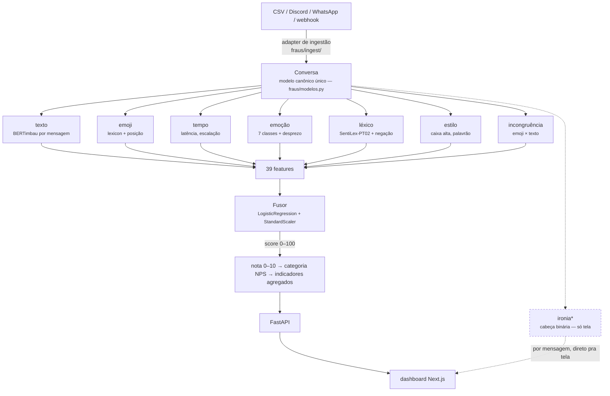
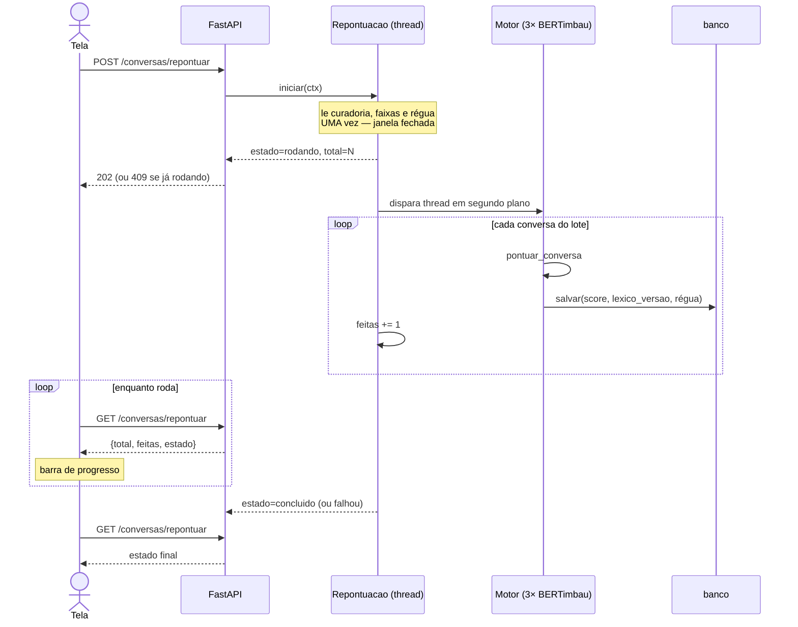

# Arquitetura

*\* a cabeça de ironia é lida por mensagem e mostrada na tela, mas **não
entra** nas 39 features do Fusor — ver a seção abaixo.*

## A decisão que explica o desenho

**Um modelo canônico, muitos adaptadores.** CSV, Totalk, transcrição de
`.docx`/`.pdf` e webhook desembocam todos em `Conversa` — e o resto do sistema
não sabe de onde o dado veio. Adicionar uma fonte é escrever um adaptador, não
tocar em sinal, fusor ou indicador.

## As sete famílias que pontuam

| família | o que mede | por que existe |
|---|---|---|
| **texto** | P(insatisfeito/neutro/satisfeito) por mensagem | o sinal principal — o único fine-tunado para a tarefa |
| **emoji** | polaridade e **posição relativa** | emoji no fim da conversa não vale o mesmo que no começo |
| **tempo** | latências, escalação, abandono | espera longa degrada satisfação (literatura de live chat) |
| **emoção** | 7 de Ekman + desprezo derivado | raiva e frustração distinguem *tipos* de insatisfação |
| **léxico** | SentiLex-PT02 com escopo de negação | âncora determinística, auditável, imune a retreino |
| **estilo** | caixa alta, alongamento, palavrão, censura | intensidade que o classificador de sentença perde |
| **incongruência** | elogio convivendo com situação negativa | é o que alcança a frase canônica do projeto |

## Onde roda, e com que motor

| | |
|---|---|
| **Backend dos modelos** | `FRAUS_BACKEND=torch` (padrão) ou `onnx` — os mesmos checkpoints, sem torch em runtime no segundo |
| **Cabeça de ironia** | `FRAUS_IRONIA_BACKEND`: `padrao` (BERTimbau), `laya` ou `laya-onnx` — troca só a leitura por mensagem; a ironia não entra no score |
| **Motor** | carregado por um provedor preguiçoso (`ProvedorDeMotor`): `frio` → `carregando` → `pronto` ou `erro`, sem fallback para dublê |
| **Aquecimento** | a carga começa em segundo plano no boot e a cada `GET /saude`; `GET /saude/prontidao` só dá 200 com o motor pronto |
| **Produção** | dashboard e API em dois projetos Vercel, estado no Supabase Postgres; a API é serverless e **esfria** |

O aquecimento reduz o cold start e não o elimina. Para eliminá-lo, a API precisa
de um container sempre ligado (ver [Limitações](limitacoes.md)).

## A ironia continua carregada, e não pontua

A oitava cabeça existe, é obrigatória para a API subir e aparece na tela **por
mensagem** — mas **saiu do vetor** em 04/09/2026.

Medida no próprio corpus de treino do fusor (B2W-Reviews01), ela marca **74% das
resenhas satisfeitas** como irônicas contra **9% das insatisfeitas**: naquele
corpus ela é um detector de sentimento **positivo**, não de ironia. O fusor
aprendeu peso **+0,77** para `ironia_prob_media`, empurrando ironia para
*satisfeito* — o inverso do que o nome promete.

> **Feature que mede outra coisa que não o nome dela é pior que feature
> ausente.** Ela some do vetor sem que ninguém perceba a inversão, porque a
> acurácia global continua ótima.

Ver [Treinamento](treinamento.md) para a medição completa.

## Régua: o que pontuou uma conversa não é fixo no tempo

Cada conversa é gravada com a **régua** que a pontuou: a assinatura do motor
servindo (`Motor.regua`, `None` no motor dublê) mais a versão da curadoria
(`lexico_versao`). Trocar de checkpoint, trocar de backend (torch/onnx) ou o
analista ensinar um termo novo ao léxico muda a régua — e o banco passa a ter
conversas antigas pontuadas por uma régua que não é mais a vigente.

O sistema não recalcula sozinho: ele **avisa**. `GET /indicadores` expõe
`pontuadas_com_regua_antiga`, contando contra a régua vigente lida a cada
requisição (nunca guardada em memória, pelo mesmo motivo de `faixas_vigentes`
e `curadoria_vigente` — sem cópia de estado envelhecendo). A tela mostra o
aviso com o motivo (checkpoint novo, léxico curado, ou os dois), nunca um
número solto sem explicação.

## Repontuar é um trabalho, não uma requisição

Zerar o aviso de régua misturada significa rodar os três BERTimbau de novo em
cada conversa do banco — em milhares de atendimentos isso estoura qualquer
timeout HTTP. `POST /conversas/repontuar` (`fraus/api/repontuacao.py`) só
dispara uma thread em segundo plano; `GET /conversas/repontuar` lê o progresso
(`total`, `feitas`, `estado`, `erro`) que a tela transforma em barra. Não é
fila — é **um trabalho por vez**: uma segunda chamada enquanto a primeira roda
recebe 409, porque duas repontuações em paralelo gravariam o mesmo banco com
duas curadorias diferentes. O estado mora na memória do processo (reiniciar a
API no meio perde o progresso, não o que já foi gravado — cada conversa salva
já carrega sua própria `lexico_versao` e régua).

## Onde cada coisa mora

| caminho | responsabilidade |
|---|---|
| `fraus/modelos.py` | `Conversa` / `Mensagem` — o modelo canônico |
| `fraus/ingest/` | adaptadores de entrada, um por formato |
| `fraus/sinais/` | as oito famílias de sinal |
| `fraus/sinais/curadoria.py` | o que o analista ensinou ao léxico — vence o SentiLex |
| `fraus/fusor.py` | `NOMES_FEATURES` (39) e o `Fusor` |
| `fraus/indicadores.py` | NPS, CSAT, contenção, falso containment, série |
| `fraus/evidencia.py` | evidência fraca — a cabeça tracejada |
| `fraus/deriva.py` | deriva de distribuição — a invariante 10 em runtime |
| `fraus/cortesia.py` | "ok, obrigado" sozinho é sem sinal, não promotor |
| `fraus/api/` | FastAPI: `criar_app` (fábrica) e as rotas por domínio |
| `fraus/api/contexto.py` | faixas, curadoria e régua vigentes, lidas por requisição |
| `fraus/api/repontuacao.py` | repontuar em segundo plano, com progresso e 409 se já rodando |
| `fraus/api/vazao.py` | teto de `/auth/*` por IP e de `/ingestao` por fonte |
| `dashboard/` | Next.js — ver [Design](design.md) |
